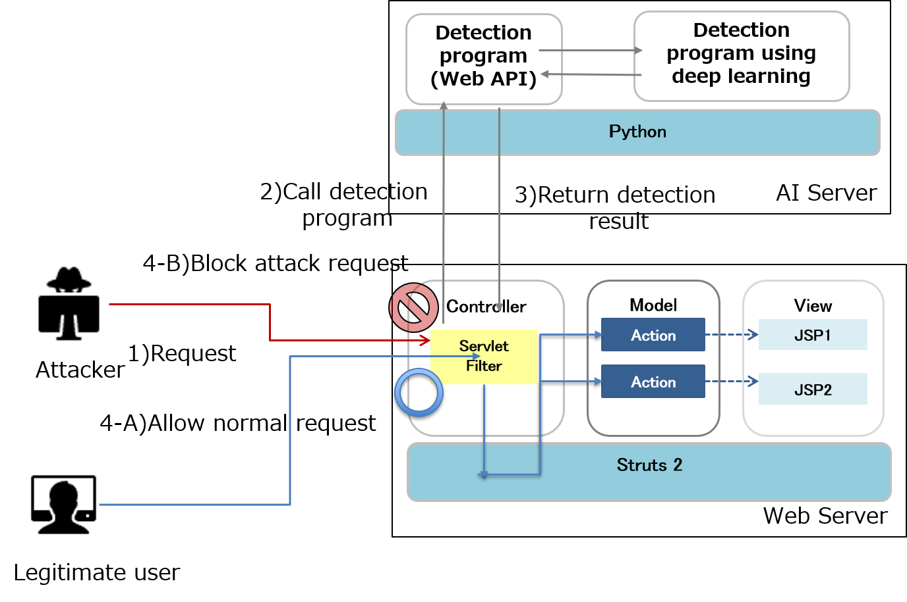

# Defending attacks leveraging Struts2

This is a sample of real-time protection tool against attacks leveraging OGNL using Deep Learning and Servlet Filter.

<a href="Defending attacks leveraging Struts2.pdf" target="_blank">White paper</a>
 

## Tool detail
###	Function of the tool
Our tool consists of the following components:
* AI Server: Detects attacks using deep learning. A Web API for detection is provided.
* Struts Server: Block atack request using Servlet Filter.

1. Struts Server: receives requests.
2. Struts Server: Extract text included in URL, header, body from request.
3. Struts Server: Extract symbols form text in request.
4. Struts Server: Call detection program with extracted symbols.
5. AI Server: Analyze symbols with deep learning 
6. AI Server: Return result code 
7. Struts Server: Check the result code and allow or block request
